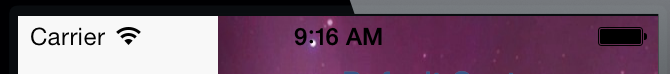
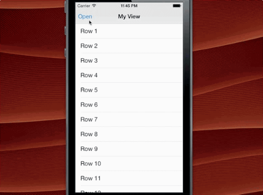

## TWTSideMenuViewController

One of the most common implementations of menu views has been the "Side Drawer", "basement", or "Side Menu" made popular in apps such as Facebook and Path. When the user taps to open the side menu the user's main context slides to the right (or left in some implementations) do display another view _below_. This works well in iOS 6 and before. What does it mean for iOS 7?

With iOS 7, apps are encouraged to use the whole screen and not rely on the 20pt status bar to be outside of the plane of your app. This breaks the existing side bar idea in that the status bar now lives over two view contexts with a single style.



Working with the team at Luvocracy, we needed to find a way to show a side menu for our iOS 7 release. Many designers on [Dribbble](http://dribbble.com) began [looking at a new approach](http://dribbble.com/shots/1154748-WhatsApp-iOS-7-Redesign) for [side bars](http://dribbble.com/shots/1185823-Side-menu). Inspired by this we worked up a quick prototype that slides the view to the right and scales revealing the menu as seen in the dribbble samples above. Moving forward from this idea and inspired by other ideas from iOS 7 we changed it from a slide to more of a viewport change.



### Usage

Implemented using a single parent view controller that manages your menu and main view as children view controllers. To setup init a new instance of the TWTSideMenuViewController and supply a menu view controller and a main view controller.

```objective-c

  // application:didFinishLaunchingWithOptions:

  self.menuViewController = [[TWTMenuViewController alloc] initWithNibName:nil bundle:nil];
  self.mainViewController = [[TWTMainViewController alloc] initWithNibName:nil bundle:nil];
  
  // create a new side menu
  self.sideMenuViewController = [[TWTSideMenuViewController alloc] initWithMenuViewController:self.menuViewController mainViewController:[[UINavigationController alloc] initWithRootViewController:self.mainViewController]];

  // specify the shadow color to use behind the 
  self.sideMenuViewController.shadowColor = [UIColor blackColor];

  // specify an edge offset to offset the open position of the menu
  self.sideMenuViewController.edgeOffset = (UIOffset) { .horizontal = 18.0f };

  // specify a scale to zoom the interface
  self.sideMenuViewController.zoomScale = 0.5634f;

  // set the side menu controller as the root view controller
  self.window.rootViewController = self.sideMenuViewController;

```

Later, when you need to change what is in the main view controller's context you can simply set the view controller with the convenience method:

```objective-c

  // All views presented in a side menu view controller have access to the side menu directly. Much like the way UINavigationController works. To swap to a new view controller simply set the main view controller:

  [self.sideMenuViewController setMainViewController:controller animated:YES closeMenu:YES];

```

### TODO

- Built for the needs of one app and needs to be used more to find more requirements
- Better support for landscape
- Lots of Testing

### Requirements

Base SDK: iOS 7
Deployment Target: iOS 6+

### Contact

TWTSideMenuViewController was created by [Two Toasters](@twotoasters) in the development of [Luvocracy](http://www.luvocracy.com).

### License

Available under the MIT License. See the LICENSE file for more.
